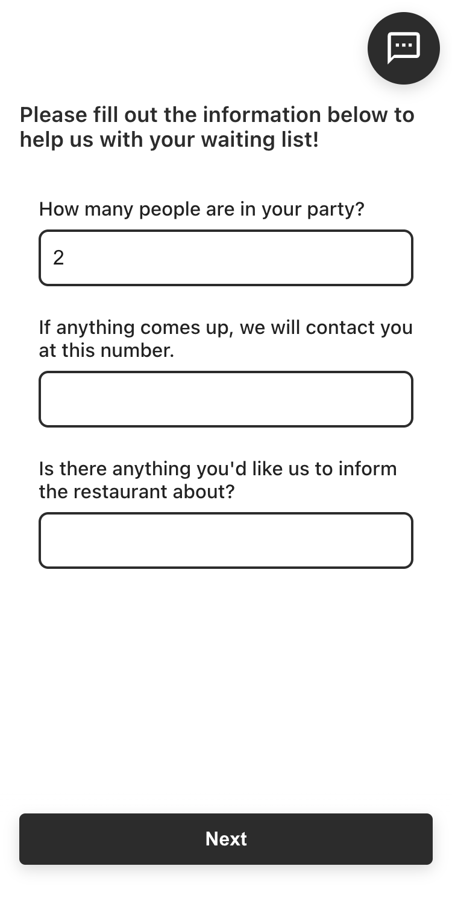
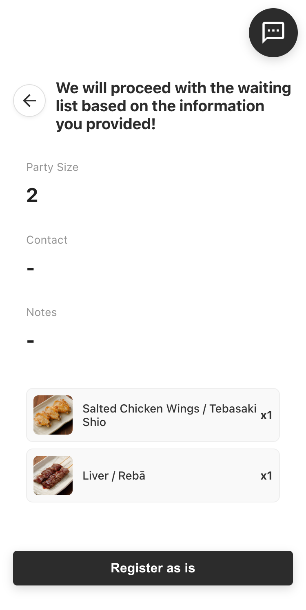
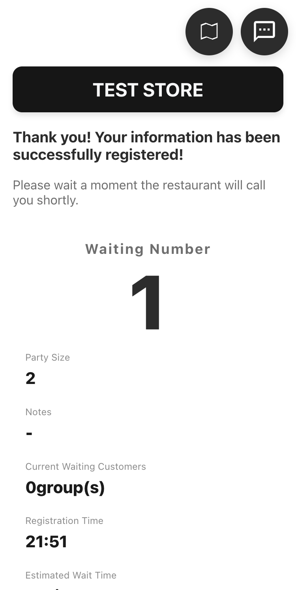
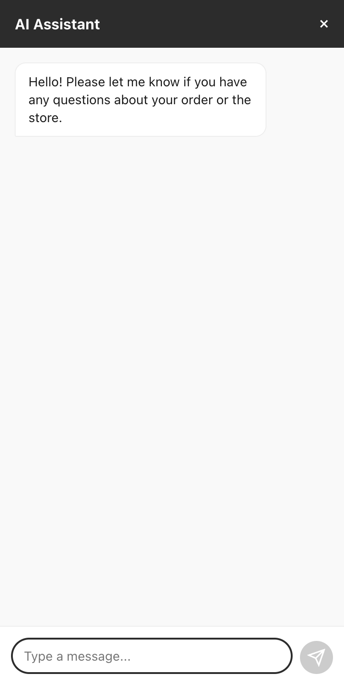
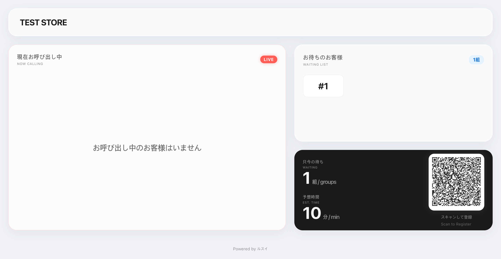
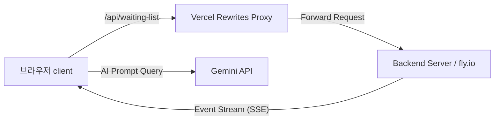

# Rusui

실시간 대기열 관리 및 AI 매장 안내 챗봇을 제공하는 스마트 웨이팅 솔루션, **Rusui**의 고객용 모바일 웹 클라이언트

## Screenshots
<!-- 실시간 대기 현황 화면, AI 챗봇 화면, 구글 맵 및 QR 코드 티켓 등의 스크린샷 이미지 배치 영역 -->
| 1. 대기 화면 진입 | 2. 실시간 대기 현황 | 3. 메뉴 프리뷰 |
| :---: | :---: | :---: |
|  |  |  |

| 4. AI 매장 가이드 챗봇 | 5. 모바일 QR 티켓 |
| :---: | :---: |
|  |  |


## Overview
**Rusui**(구 Yoyaku Mate)는 인기 매장이나 식당에 방문한 고객들이 스마트폰을 통해 편리하게 대기열을 조회하고 시간을 활용할 수 있도록 돕는 실시간 웨이팅 시스템의 **고객용 웹 클라이언트**입니다. 

고객은 현장에서 마냥 기다릴 필요 없이, 모바일 기기로 자신의 대기 상태를 실시간으로 확인하고 주변을 자유롭게 다닐 수 있으며, 대기 시간 중에는 매장 특화 AI 챗봇을 통해 각종 이용 안내 및 정보 조회를 손쉽게 제공받을 수 있습니다.

## Problem
* **불안한 대기 시간과 고객 이탈:** 매장 대기 시간이 길어질수록 고객들은 언제 차례가 올지 몰라 매장 주변에 묶여 있게 되며, 피로가 쌓여 대기를 포기하고 이탈하는 문제가 발생합니다.
* **외국인 관광객의 접근성 한계:** 매장 위치 찾기나 복잡한 대기 현황판 확인이 어려워 글로벌 관광객을 응대하는 데 한계가 있습니다.
* **반복적인 고객 문의로 인한 직원 피로도:** 영업시간, 화장실 위치, 대표 메뉴 등 대기 중인 고객이 직원에게 반복적으로 하는 단순 질문들로 인해 매장 운영 리소스가 불필요하게 낭비됩니다.

## Solution
* **SSE(Server-Sent Events) 기반 실시간 상태 조회:** 폴링(Polling) 없이 실시간으로 대기 인원 및 내 대기 순서, 예상 대기 시간을 서버로부터 단방향 스트리밍 받아 제공함으로써 안심하고 매장 밖에서 대기할 수 있도록 개선했습니다.
* **Gemini AI 기반 양방향 가이드 챗봇:** 매장의 실시간 현황 및 메타데이터(영업시간, 규칙, 위치 등)를 컨텍스트로 제공하는 AI 챗봇을 통합하여, 직원의 개입 없이도 대기 중인 고객의 다양한 질문에 정확하게 답변합니다.
* **글로벌 다국어 지원 및 지도 연동:** 한국어, 일본어, 영어, 중국어, 태국어, 베트남어 등 i18n 번역 리소스를 탑재하고 Google Maps API를 연동하여 외국인 관광객도 손쉽게 매장 정보를 찾고 도달할 수 있도록 개선했습니다.
* **모바일 QR 티켓 발급:** 현장 보드 및 키오스크 연동을 위한 전용 QR 코드를 웹 상에서 즉시 발급하여 대기 순서 확인 및 접수의 디지털 프로세스를 완성했습니다.

## Features
* **실시간 대기열 상태 확인:** 현재 내 순서와 총 대기 팀 수, 소요 예상 시간 실시간 스트리밍 제공
* **AI 매장 가이드 챗봇:** Gemini API 연동을 통해 매장 이용 규칙, 주변 정보, 추천 메뉴 등에 대한 24/7 자동 답변 지원
* **Google Maps 기반 매장 위치 & 길찾기:** Google Maps SDK를 통한 매장 상세 위치 지도 시각화
* **다국어(i18n) 지원:** 한국어, ja, en, zh, th, vi 등의 다국어 현지화 인터페이스 제공
* **모바일 QR 티켓:** 현장 매니저 또는 보드에서 조회할 수 있는 고유 QR 코드 생성 및 표시

## Tech Stack
* **Core:** React 19, React Router DOM 7
* **HTTP & Stream:** Axios, EventSource (SSE)
* **APIs:** Google Maps API (`@react-google-maps/api`), Gemini API
* **i18n:** 다국어 리소스 적용 (`ko.json`, `ja.json` 등)
* **Deployment & Proxy:** Vercel (Edge Middleware Rewrites 설정을 통한 CORS 우회 및 API 엔드포인트 프록시 처리)

## Architecture
### 1. 디렉토리 구조
```bash
src/
├── api/                  # API 통신 정의 (Axios 인터셉터, SSE 구독 및 대기열 서비스)
├── components/           # 공통 재사용 UI 컴포넌트
├── containers/           # 비즈니스 로직 및 개별 화면 (대기 화면, AI 챗봇, 실시간 보드)
│   ├── board/            # 실시간 현황판 보드 화면
│   ├── chat-bot/         # Gemini AI 챗봇 화면
│   └── waiting-screen/   # 고객 대기 상세 화면 (지도, 메뉴, QR 등)
├── data/                 # 정적 데이터 (국적 데이터 등)
├── hook/                 # React 커스텀 훅
├── i18n/                 # 다국어 리소스 (ko.json, ja.json 등)
├── styles/               # 전역 스타일 및 디자인 테마
└── utils/                # 유틸리티 함수
```

### 2. 네트워크 & 프록시 흐름
클라이언트 애플리케이션은 보안 및 CORS 방지를 위해 Vercel Rewrite Proxy를 거쳐 백엔드 API와 통신합니다.


## Lessons Learned
* **CORS 및 프록시 설정:** 로컬 및 운영 환경에서 흔히 발생하는 CORS(Cross-Origin Resource Sharing) 문제를 해결하기 위해 Vercel의 Rewrite 기능을 프록시로 설계하여 보안성을 확보하고 안전하게 외부 API 백엔드와 연결하는 방법을 익혔습니다.
* **네트워크 오프라인 상태에 대응하는 클라이언트 견고성 확보:** 대기 중인 고객이 일시적인 음영 지역 등으로 오프라인 상태가 되더라도, SSE(EventSource)의 자동 재연결(Reconnection) 메커니즘이 백그라운드에서 작동합니다. 이를 통해 다시 온라인으로 복구되는 즉시 점포의 승인/호출 알림 상태를 누락 없이 안전하게 화면에 동기화하는 구조를 갖췄습니다.
* **실시간 단방향 스트리밍(SSE):** WebSocket에 비해 오버헤드가 적고 HTTP 프로토콜 상에서 간단히 동작하는 SSE(Server-Sent Events)를 채택하여 대기열 데이터의 실시간 동기화를 효율적으로 구현했습니다.
* **AI Context 프롬프팅 최적화:** 외부 대규모 언어 모델(LLM)을 웹 서비스에 연동할 때, 사용자가 묻는 시점의 실시간 매장 대기 현황이나 기본 설정 데이터를 시스템 프롬프트로 주입함으로써 오답률(Hallucination)을 대폭 낮추고 정확하고 정제된 대답을 유도하는 능력을 키웠습니다.

## Getting Started (시작 가이드)

### 1. 환경 변수 설정
로컬 개발 환경 구성을 위해 프로젝트 루트 디렉토리에 `.env.development` 파일을 작성합니다.  
*(API 키 및 민감 정보는 배포 환경 혹은 비공개 개발 환경 변수로 로컬에만 관리합니다.)*

```env
# 개발 환경 API 서버 주소
REACT_APP_API_URL=http://localhost:8080/api

# 구글 맵 API 키 (클라이언트 전용)
REACT_APP_GOOGLE_MAPS_API_KEY=YOUR_GOOGLE_MAPS_API_KEY

# Gemini AI 챗봇 API 키
REACT_APP_GEMINI_API_KEY=YOUR_GEMINI_API_KEY
```

### 2. 패키지 설치 및 실행
```bash
# 의존성 패키지 설치
npm install

# 로컬 개발 서버 실행
npm start
```
실행이 완료되면 브라우저에서 `http://localhost:3000` 주소로 접속할 수 있습니다.

