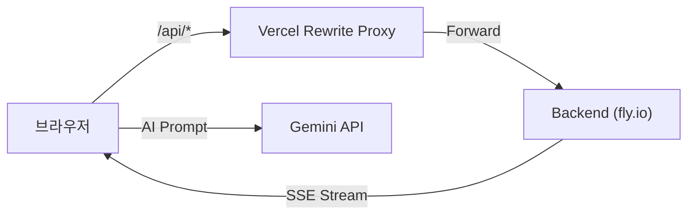

# Rusui — Web Client

QR 코드 기반 실시간 대기열 관리 및 AI 점포 안내 챗봇을 제공하는 손님용 모바일 웹 클라이언트입니다.

## Tech Stack

| 항목 | 기술 |
|------|------|
| Framework | React 19 |
| Router | React Router DOM 7 |
| HTTP / Stream | Axios, EventSource (SSE) |
| Maps | Google Maps API |
| AI | Gemini API |
| i18n | 자체 구현 (ja / ko / en / zh / th / vi) |
| Deployment | Vercel (Edge Rewrite Proxy) |

## Getting Started

```bash
npm install
npm start
```

브라우저에서 `http://localhost:3000` 으로 접근합니다.

### 환경 변수

```env
REACT_APP_API_URL=http://localhost:8080/api
REACT_APP_GOOGLE_MAPS_API_KEY=your_google_maps_api_key
REACT_APP_GEMINI_API_KEY=your_gemini_api_key
```

## Architecture

```
src/
├── api/            → API 호출 정의 (Axios + EventSource)
├── containers/     → 화면 단위 비즈니스 로직
│   ├── waiting-screen/   → 손님 대기 전체 흐름
│   ├── board/            → 실시간 현황판
│   └── chat-bot/         → AI 챗봇
├── components/     → 공통 UI 컴포넌트
├── hook/           → 커스텀 훅
├── i18n/           → 다국어 리소스
└── utils/          → 공통 유틸리티
```



→ 상세 구조: [`docs/implementation/architecture.ko.md`](./docs/implementation/architecture.ko.md)

## Documentation

구현 상세, 설계 결정, 트러블슈팅 기록은 [`docs/README.ko.md`](./docs/README.ko.md)를 참조하세요.
