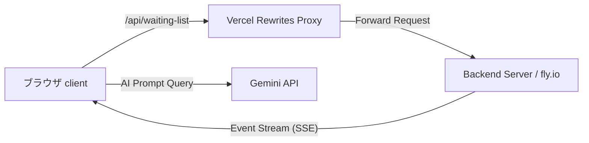

# Rusui

リアルタイムの待機列管理とAI店舗案内チャットボットを提供するスマート待機ソリューション、**Rusui**のお客様向けモバイルWebクライアント

## Screenshots
<!-- リアルタイム待機状況画面、AIチャットボット画面、GoogleマップおよびQRコードチケットなどのスクリーンショット画像配置領域 -->
| 1. 待機画面への進入 | 2. リアルタイム待機状況 | 3. メニュープレビュー |
| :---: | :---: | :---: |
|  |  |  |

| 4. AI店舗ガイドチャットボット | 5. モバイルQRチケット |
| :---: | :---: |
|  |  |

## Overview
**Rusui**（旧 Yoyaku Mate）は、人気の店舗や飲食店を訪れたお客様がスマートフォンを通じて快適に待機列を確認し、時間を有効活用できるように支援するリアルタイム順番待ちシステムの**お客様向けWebクライアント**です。 

お客様は店頭で長時間待つ必要がなく、モバイルデバイスで自身の待機状態をリアルタイムで確認しながら周辺を自由に散策できます。また、待機時間中には店舗特化型のAIチャットボットを通じて、各種利用案内や店舗情報の問い合わせを手軽に行うことができます。

## Problem
* **不安定な待ち時間と顧客の離脱:** 待ち時間が長くなるほど、お客様はいつ自分の順番が来るか分からず店頭周辺に拘束され、疲労が蓄積して待機を諦め離脱してしまう問題が発生します。
* **外国人観光客のアクセシビリティの限界:** 店舗の位置情報の把握や複雑な待機状況板の確認が難しく、グローバルな観光客への対応に限界があります。
* **繰り返される問い合わせによるスタッフの負担:** 営業時間、お手洗いの場所、代表メニューなど、待機中のお客様からスタッフへの繰り返される単純な質問によって、店舗の運営リソースが不必要に浪費されています。

## Solution
* **SSE（Server-Sent Events）ベースのリアルタイム状況照会:** ポーリング（Polling）なしでリアルタイムに待機人数や自身の順番、予想待ち時間をサーバーから単方向ストリーミングとして受け取ることで、安心してお店の外で待機できるよう改善しました。
* **Gemini AIベースの双方向ガイドチャットボット:** 店舗のリアルタイムな状況およびメタデータ（営業時間、ルール、位置など）をコンテキストとして提供するAIチャットボットを統合し、スタッフが介入することなく待機中のお客様の多様な質問に正確に回答します。
* **多言語対応と地図の連動:** 日本語、韓国語、英語、中国語、タイ語、ベトナム語などのi18n翻訳リソースを搭載し、Google Maps APIを連動して外国人観光客も簡単に店舗情報を見つけてスムーズに到達できるよう改善しました。
* **モバイルQRチケットの発行:** 店頭のサイネージやキオスクと連動する固有のQRコードをWeb上で即時発行し、待機順の確認および受付のデジタルプロセスを構築しました。

## Features
* **リアルタイム待機列状況確認:** 現在の順番、総待機組数、予想待ち時間のリアルタイムストリーミング提供
* **AI店舗ガイドチャットボット:** Gemini APIの連携を通じた店舗利用ルール、周辺情報、おすすめメニューなどに対する24時間自動回答の支援
* **Google Mapsベースの店舗位置情報＆ルート案内:** Google Maps SDKによる店舗詳細位置の地図の可視化
* **多言語（i18n）対応:** 日本語、韓国語、英語、中国語、タイ語、ベトナム語などのローカライズされたインターフェースの提供
* **モバイルQRチケット:** 現場のマネージャーやサイネージで照会できる固有のQRコード生成および表示

## Tech Stack
* **Core:** React 19, React Router DOM 7
* **HTTP & Stream:** Axios, EventSource (SSE)
* **APIs:** Google Maps API (`@react-google-maps/api`), Gemini API
* **i18n:** 多言語リソースの適用（`ja.json`、`ko.json`など）
* **Deployment & Proxy:** Vercel（Edge Middleware Rewrites設定によるCORS回避およびAPIエンドポイントのプロキシ処理）

## Architecture
### 1. フォルダ構成
```bash
src/
├── api/                  # API通信の定義（Axiosインターセプター、SSE購読および待機列サービス）
├── components/           # 共通再利用UIコンポーネント
├── containers/           # ビジネスロジックおよび個別画面（待機画面、AIチャットボット、リアルタイムボード）
│   ├── board/            # リアルタイム状況掲示板画面
│   ├── chat-bot/         # Gemini AIチャットボット画面
│   └── waiting-screen/   # お客様待機詳細画面（地図、メニュー、QRなど）
├── data/                 # 静的データ（国籍データなど）
├── hook/                 # Reactカスタムフック
├── i18n/                 # 多言語リソース（ja.json、ko.jsonなど）
├── styles/               # グローバルスタイルおよびデザインテーマ
└── utils/                # ユーティリティ関数
```

### 2. ネットワーク＆プロキシの流れ
クライアントアプリケーションは、セキュリティ向上およびCORS防止のため、VercelのRewriteプロキシを経由してバックエンドAPIと通信します。


## Lessons Learned
* **CORSおよびプロキシ設定:** ローカルおよび本番環境で発生しがちなCORS（Cross-Origin Resource Sharing）問題を解決するため、VercelのRewrite機能をプロキシとして設計し、セキュリティを確保しながら安全に外部APIバックエンドと接続する方法を習得しました。
* **リアルタイム単方向ストリーミング（SSE）:** WebSocketに比べてオーバーヘッドが少なく、HTTPプロトコル上でシンプルに動作するSSE（Server-Sent Events）を採用し、待機列データのリアルタイム同期を効率的に実装しました。
* **AI Contextプロンプティングの最適化:** 外部の大規模言語モデル（LLM）をWebサービスに連携する際、ユーザーが質問した時点のリアルタイムな店舗待機状況や基本設定データをシステムプロンプトとして注入することで、ハルシネーション（誤回答）を大幅に減らし、正確で洗練された回答を誘導する能力を培いました。

## Getting Started（セットアップガイド）

### 1. 環境変数の設定
ローカル開発環境を構築するため、プロジェクトルートディレクトリに `.env.development` ファイルを作成します。  
*（APIキーおよび機密情報は、デプロイ環境または非公開の開発環境変数としてローカルのみで管理します。）*

```env
# 開発環境 API サーバーアドレス
REACT_APP_API_URL=http://localhost:8080/api

# Google マップ API キー（クライアント専用）
REACT_APP_GOOGLE_MAPS_API_KEY=YOUR_GOOGLE_MAPS_API_KEY

# Gemini AI チャットボット API キー
REACT_APP_GEMINI_API_KEY=YOUR_GEMINI_API_KEY
```

### 2. パッケージのインストールと起動
```bash
# 依存パッケージのインストール
npm install

# ローカル開発サーバーの起動
npm start
```
起動が完了したら、ブラウザで `http://localhost:3000` にアクセスしてください。