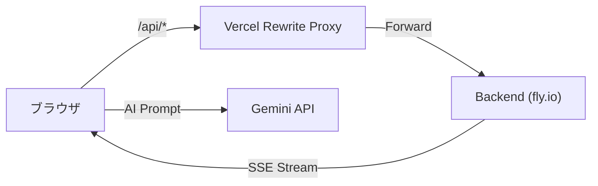

# Rusui — Web Client

QRコードベースのリアルタイム待機列管理およびAI店舗案内チャットボットを提供するお客様用モバイルウェブクライアントです。

## Screenshots
<!-- リアルタイム待機状況画面、AIチャットボット画面、GoogleマップおよびQRコードチケットなどのスクリーンショット画像配置領域 -->
| 1. 待機画面への進入 | 2. リアルタイム待機状況 | 3. メニュープレビュー |
| :---: | :---: | :---: |
|  |  |  |

| 4. AI店舗ガイドチャットボット | 5. モバイルQRチケット |
| :---: | :---: |
|  |  |

## Tech Stack

| 項目 | 技術 |
|------|------|
| Framework | React 19 |
| Router | React Router DOM 7 |
| HTTP / Stream | Axios, EventSource (SSE) |
| Maps | Google Maps API |
| AI | Gemini API |
| i18n | 独自実装 (ja / ko / en / zh / th / vi) |
| Deployment | Vercel (Edge Rewrite Proxy) |

## Getting Started

```bash
npm install
npm start
```

ブラウザから `http://localhost:3000` へアクセスします。

### 環境変数

```env
REACT_APP_API_URL=http://localhost:8080/api
REACT_APP_GOOGLE_MAPS_API_KEY=your_google_maps_api_key
REACT_APP_GEMINI_API_KEY=your_gemini_api_key
```

## Architecture

```
src/
├── api/            → API呼び出し定義 (Axios + EventSource)
├── containers/     → 画面単位のビジネスロジック
│   ├── waiting-screen/   → お客様待機フロー全体
│   ├── board/            → リアルタイム状況板
│   └── chat-bot/         → AIチャットボット
├── components/     → 共通UIコンポーネント
├── hook/           → カスタムフック
├── i18n/           → 多言語リソース
└── utils/          → 共通ユーティリティ
```



→ 詳細構造: [`docs/implementation/architecture.md`](./docs/implementation/architecture.md)

## Documentation

実装の詳細、設計決定、トラブルシューティングの記録は、 [`docs/`](./docs/README.md) を参照してください。