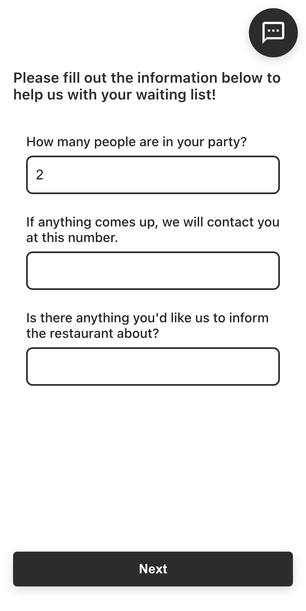
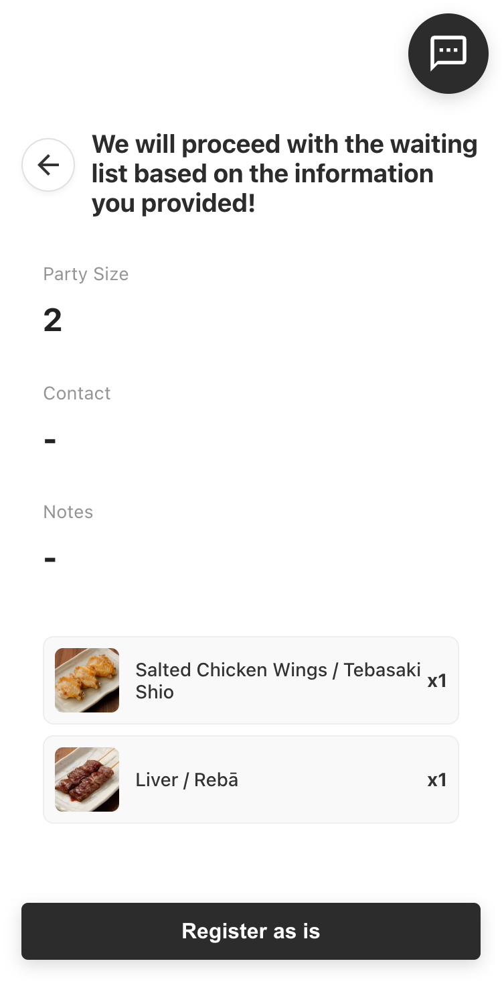
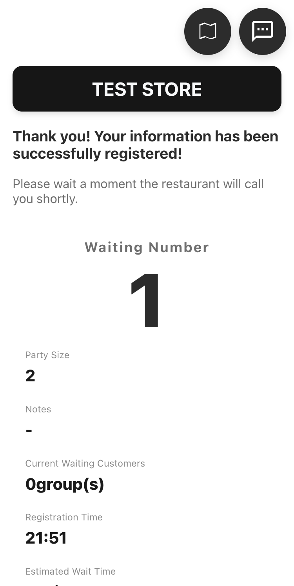
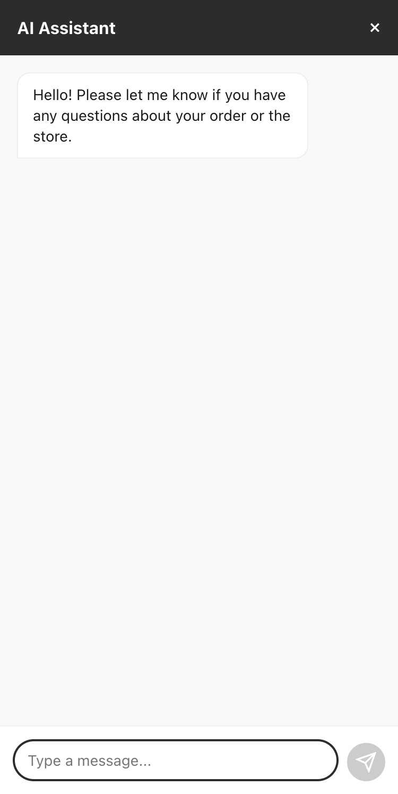
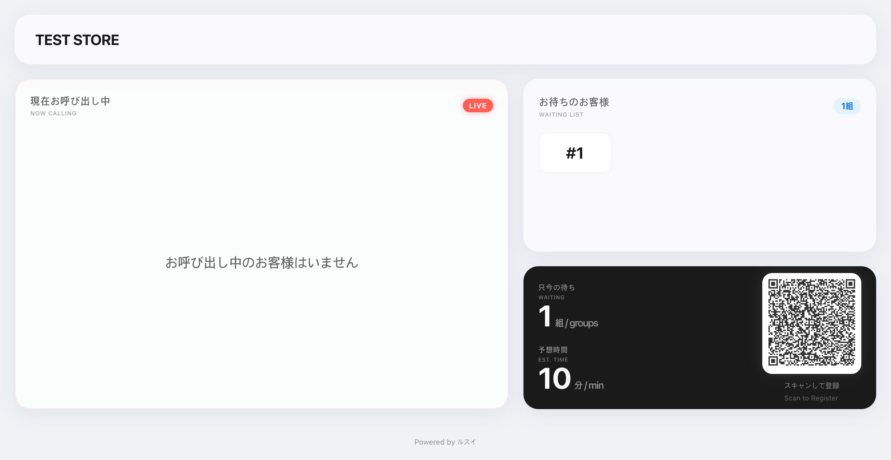
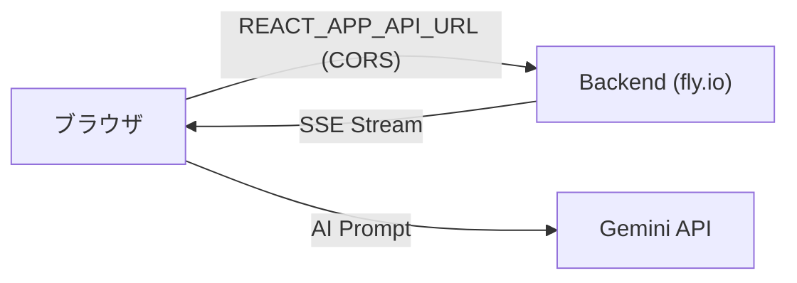

# Rusui — Web Client

QRコードベースのリアルタイム待機列管理およびAI店舗案内チャットボットを提供するお客様用モバイルウェブクライアントです。

## Screenshots
<!-- リアルタイム待機状況画面、AIチャットボット画面、GoogleマップおよびQRコードチケットなどのスクリーンショット画像配置領域 -->
| 1. 待機画面への進入 | 2. リアルタイム待機状況 | 3. メニュープレビュー |
| :---: | :---: | :---: |
|  |  |  |

| 4. AI店舗ガイドチャットボット | 5. リアルタイム状況掲示板 |
| :---: | :---: |
|  |  |

## Tech Stack

| 項目 | 技術 |
|------|------|
| Framework | React 19 |
| Router | React Router DOM 7 |
| HTTP / Stream | Axios, EventSource (SSE) |
| Maps | Google Maps API |
| AI | Gemini API |
| i18n | 独自実装 (ja / en / ko / fr / de / ru / vi / th / zh / id / ar / es / it / pt) |
| Deployment | Vercel (本番) / Cloudflare Workers Static Assets (開発) |

## Getting Started

```bash
npm install
npm start
```

ブラウザから `http://localhost:3000` へアクセスします。

### 環境ティア (local / remote-dev / prod)

| コマンド | 環境ファイル | 接続先バックエンド | 用途 |
|---|---|---|---|
| `npm start` / `npm run build` | `.env.development` / `.env.production` | `localhost:8080` / `rusui-prod.fly.dev` | ローカル開発 / 本番 |
| `npm run start:remote-dev` / `npm run build:remote-dev` | `.env.remote-dev` | `rusui-dev.fly.dev` | 共有の開発用サーバー。実機(スマートフォン等)からQRコード経由でアクセスする場合、`localhost`は端末自身を指してしまい通信エラーになるため、このティアを使う |
| `npm run deploy:remote-dev` | 〃 | 〃 | `build:remote-dev` 後、Cloudflare Workers (`yoyaku-mate-dev`) へデプロイ |

`yoyaku_mate_provider` 側は `--dart-define=APP_ENV=dev` で起動すると、このremote-devティアに接続する。

### 環境変数

```env
REACT_APP_API_URL=http://localhost:8080/api
REACT_APP_GOOGLE_MAPS_API_KEY=your_google_maps_api_key
REACT_APP_GEMINI_API_KEY=your_gemini_api_key
```

## Architecture

```
src/
├── api/            → API呼び出し定義 (Axios + EventSource)
├── containers/     → 画面単位のビジネスロジック
│   ├── waiting-screen/   → お客様待機フロー全体
│   ├── board/            → リアルタイム状況板
│   └── chat-bot/         → AIチャットボット
├── components/     → 共通UIコンポーネント
├── hook/           → カスタムフック
├── i18n/           → 多言語リソース
└── utils/          → 共通ユーティリティ
```


```mermaid
graph LR
    Browser["ブラウザ"] -->|"REACT_APP_API_URL (CORS)"| Server["Backend (fly.io)"]
    Server -->|"SSE Stream"| Browser
    Browser -->|"AI Prompt"| Gemini["Gemini API"]
```

→ 詳細構造: [`docs/implementation/architecture.md`](./docs/implementation/architecture.md)

## Documentation

実装の詳細、設計決定、トラブルシューティングの記録は、 [`docs/`](./docs/README.md) を参照してください。