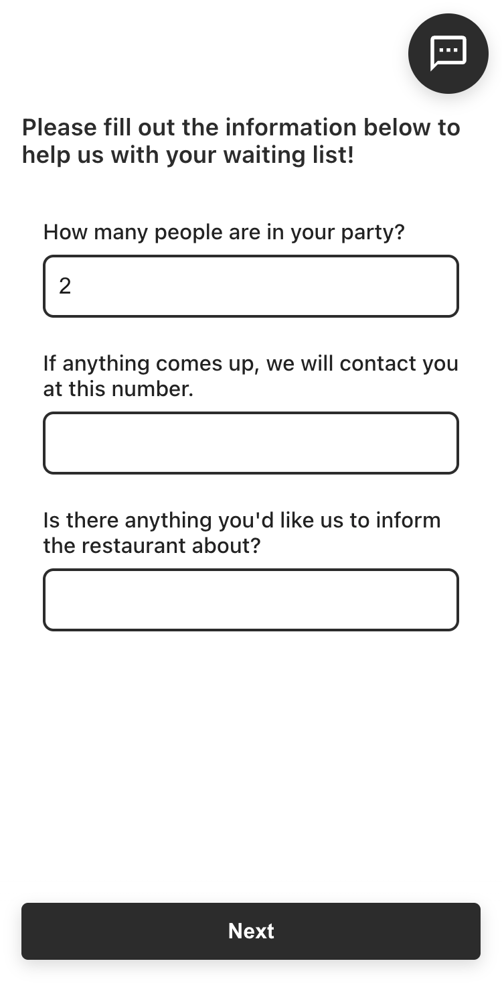
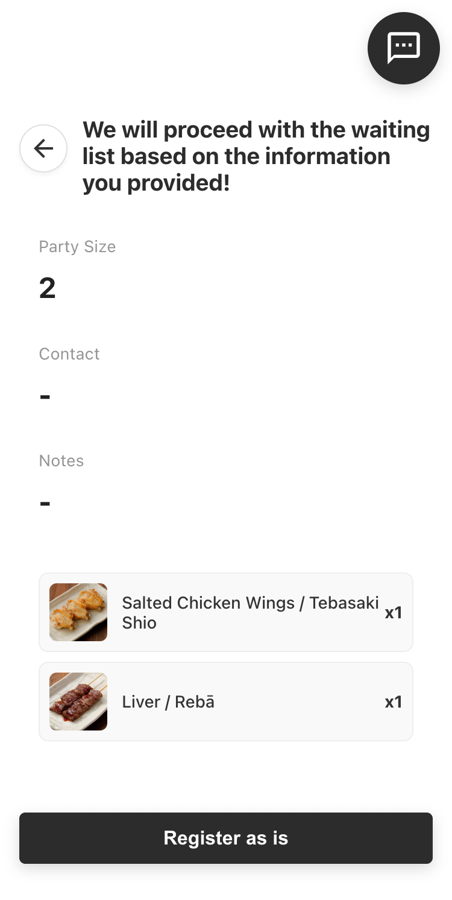
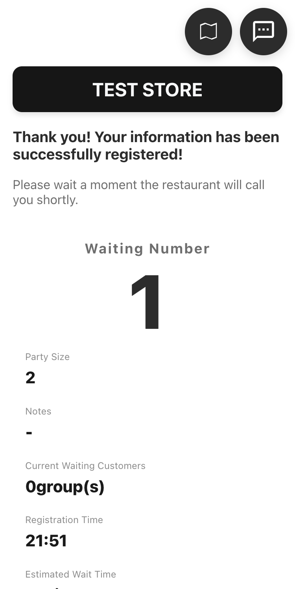
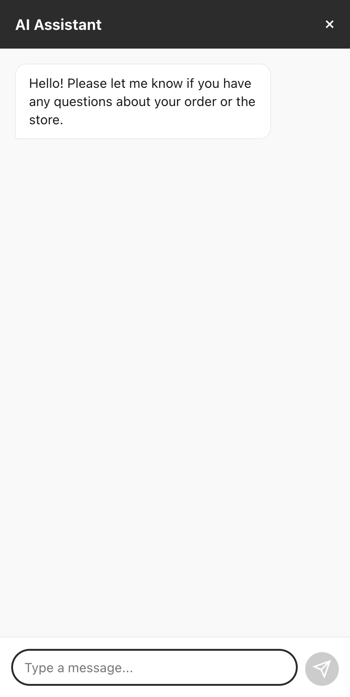
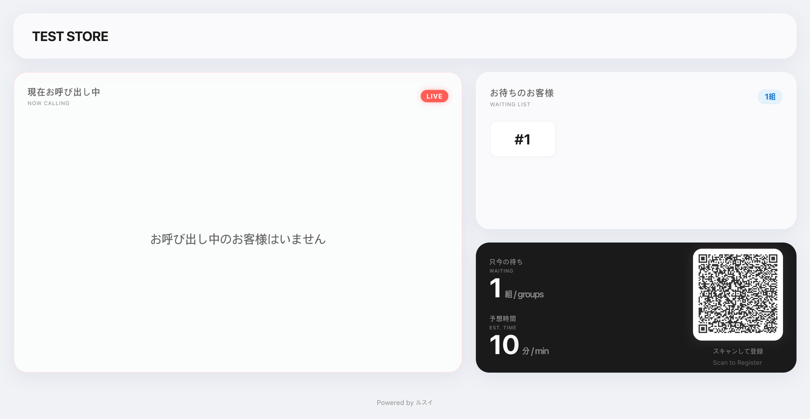
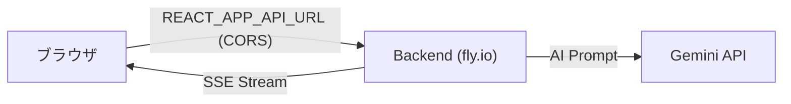

# Rusui — Web Client

QRコードベースのリアルタイム待機列管理およびAI店舗案内チャットボットを提供するお客様用モバイルウェブクライアントです。

## Screenshots
<!-- リアルタイム待機状況画面、AIチャットボット画面、GoogleマップおよびQRコードチケットなどのスクリーンショット画像配置領域 -->
| 1. 待機画面への進入 | 2. リアルタイム待機状況 | 3. メニュープレビュー |
| :---: | :---: | :---: |
|  |  |  |

| 4. AI店舗ガイドチャットボット | 5. リアルタイム状況掲示板 |
| :---: | :---: |
|  |  |

## Tech Stack

| 項目 | 技術 |
|------|------|
| Framework | React 19 |
| Router | React Router DOM 7 |
| HTTP / Stream | Axios, EventSource (SSE) |
| Maps | Google Maps API (現在 `MAP_CHATBOT_ENABLED = false` で非表示) |
| AI | Gemini API (バックエンド経由。APIキーはクライアントに持たない) |
| i18n | 独自実装 (ja / en / ko / fr / de / ru / vi / th / zh / id / ar / es / it / pt) |
| Deployment | Cloudflare Workers Static Assets (開発: `yoyaku-mate-dev` / 本番: `yoyaku-mate-prod`) |

## Getting Started

```bash
npm install
npm start
```

ブラウザから `http://localhost:3000` へアクセスします。

### 環境ティア (local / dev / prod)

サフィックス無し=ローカル、`:dev`=共有開発サーバー、`:prod`=本番。`yoyaku_mate_admin` と同じ命名規則に揃えてある。

| コマンド | 環境ファイル | 接続先バックエンド | 用途 |
|---|---|---|---|
| `npm start` | `.env.development` | `localhost:8080` | ローカル開発 |
| `npm run start:dev` / `npm run build:dev` | `.env.dev` | `rusui-dev.fly.dev` | 共有の開発用サーバー。実機(スマートフォン等)からQRコード経由でアクセスする場合、`localhost`は端末自身を指してしまい通信エラーになるため、このティアを使う |
| `npm run deploy:dev` | 〃 | 〃 | `build:dev` 後、Cloudflare Workers (`yoyaku-mate-dev`) へ手動デプロイ |
| `npm run build` / `npm run build:prod` | `.env.production` | `rusui-prod.fly.dev` | 本番ビルド (両者は同一。`react-scripts build` は常にproductionモードで動くため) |
| `npm run deploy:prod` | 〃 | 〃 | `build:prod` 後、Cloudflare Workers (`yoyaku-mate-prod`) へ手動デプロイ (`wrangler deploy --env production`) |

`develop` への push 時は Cloudflare Workers Builds (Git連携) により開発用へ**自動デプロイ**される。
この設定は Cloudflare のダッシュボード側にあり、リポジトリ内のファイルには現れない。
`npm run deploy:dev` は自動デプロイを待たず即座に反映したい場合の手動経路。

`--env production` を付けない `wrangler deploy` は常に開発用 (`yoyaku-mate-dev`) へ出る。

`yoyaku_mate_provider` 側は `--dart-define=APP_ENV=dev` で起動すると、このdevティアに接続する。

### 環境変数

```env
REACT_APP_API_URL=http://localhost:8080/api
REACT_APP_GOOGLE_MAPS_API_KEY=your_google_maps_api_key
```

- Gemini のAPIキーはここに置かない。`REACT_APP_*` はビルド時に公開JSバンドルへ埋め込まれ、誰でも読めるため。チャットボット・翻訳はバックエンド (`yoyaku_mate_server`) が代理で呼び出す

## Architecture

```
src/
├── api/            → API呼び出し定義 (Axios + EventSource)
├── containers/     → 画面単位のビジネスロジック
│   ├── waiting-screen/   → お客様待機フロー全体
│   ├── board/            → リアルタイム状況板
│   └── chat-bot/         → AIチャットボット
├── components/     → 共通UIコンポーネント
├── hook/           → カスタムフック
├── i18n/           → 多言語リソース
└── utils/          → 共通ユーティリティ
```


```mermaid
graph LR
    Browser["ブラウザ"] -->|"REACT_APP_API_URL (CORS)"| Server["Backend (fly.io)"]
    Server -->|"SSE Stream"| Browser
    Server -->|"AI Prompt"| Gemini["Gemini API"]
```

→ 詳細構造: [`docs/implementation/architecture.md`](./docs/implementation/architecture.md)

## Documentation

実装の詳細、設計決定、トラブルシューティングの記録は、 [`docs/`](./docs/README.md) を参照してください。